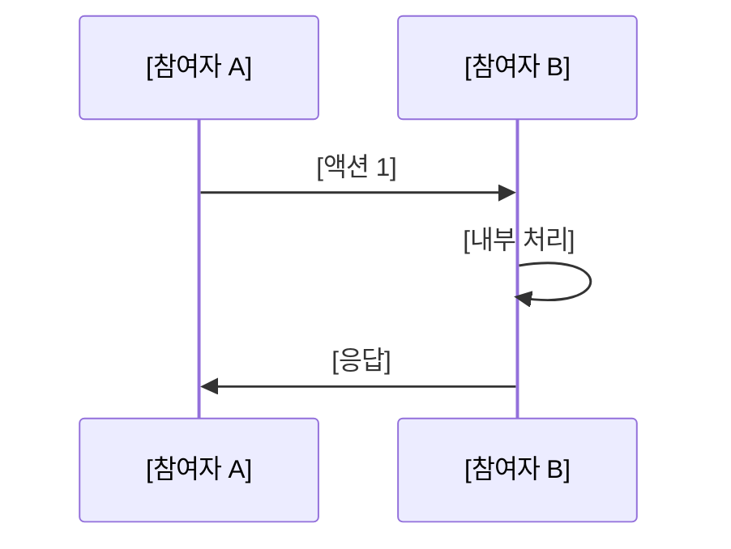
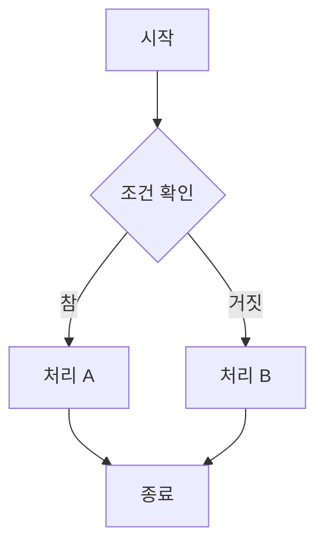
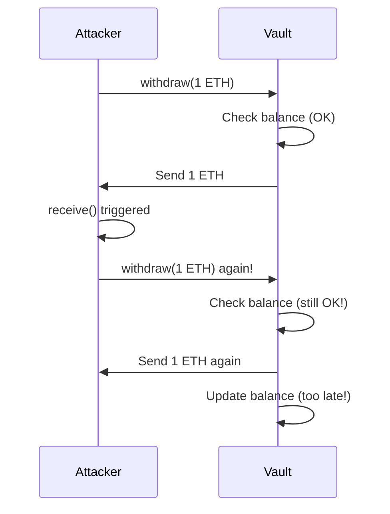
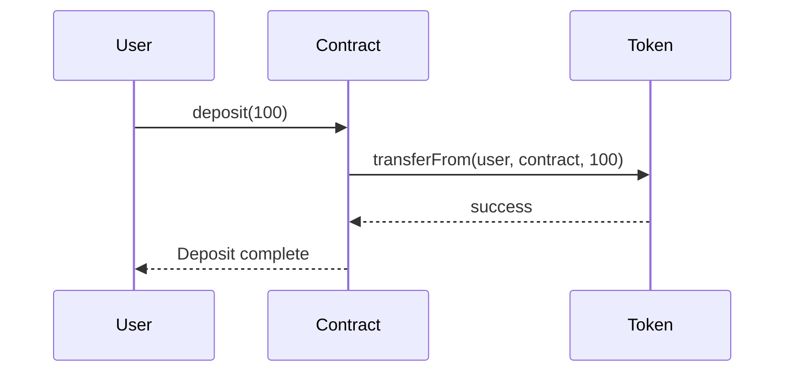
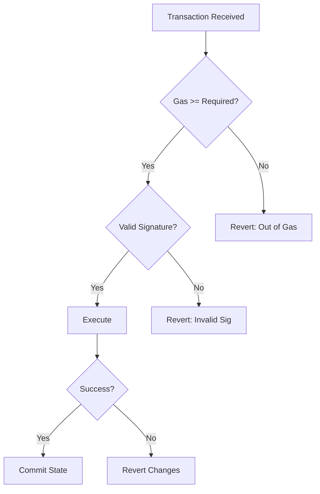
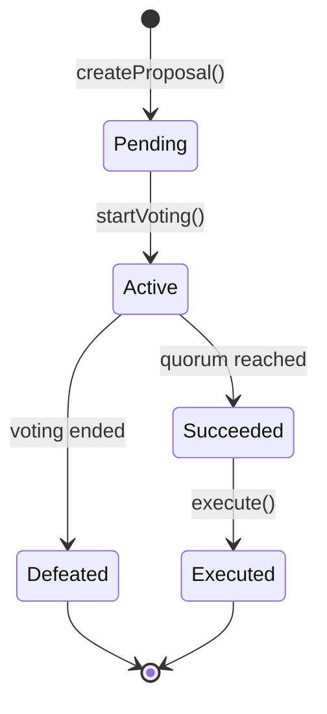

# 다이어그램 해석 문제 템플릿

> **참고:** 이 템플릿을 복사하여 주차별 퀴즈에 사용하세요.
> 다이어그램 문제는 **시각적 이해력**과 **흐름 분석 능력**을 테스트합니다.

---

## 문제 [N]: [카테고리] (다이어그램 해석)

다음 다이어그램은 [상황/흐름]을 보여줍니다:



또는



**질문:**

1) [흐름/상태에 대한 질문 - "왜" 이런 일이 일어나는지]


2) [문제점/개선점에 대한 질문 - "어떻게" 수정할 수 있는지]


3) [변경된 다이어그램 질문 - 수정 후 어떻게 바뀌는지] (선택)


---

## 실제 예시: 재진입 공격 흐름

```markdown
## 문제 10: 재진입 공격 흐름 (다이어그램 해석)

다음 다이어그램은 재진입 공격의 흐름을 보여줍니다:



**질문:**

1) 왜 두 번째 `Check balance`가 통과하나요?


2) 이 문제를 막으려면 다이어그램의 어느 단계를 어디로 옮겨야 하나요?


3) CEI 패턴을 적용하면 수정된 흐름은 어떻게 바뀌나요? (간단히 설명)

```

---

## 다이어그램 유형별 예시

### 1. Sequence Diagram (시퀀스 다이어그램)
트랜잭션 흐름, 컨트랙트 간 호출, 공격 시나리오에 사용



### 2. Flowchart (플로우차트)
의사결정, 상태 전이, 조건 분기에 사용



### 3. State Diagram (상태 다이어그램)
컨트랙트 상태, 라이프사이클에 사용



---

## 작성 가이드라인

### 질문 작성 시

1. **1번 질문**: 현재 상태/흐름 이해 (왜 이런 일이 일어나는가?)
2. **2번 질문**: 문제점 식별 및 해결책 (어떻게 고칠 수 있는가?)
3. **3번 질문**: 변경 후 결과 예측 (수정하면 어떻게 바뀌는가?)

### 다이어그램 선택 기준

| 주제 | 권장 다이어그램 |
|------|-----------------|
| 트랜잭션 흐름 | sequenceDiagram |
| 공격 시나리오 | sequenceDiagram |
| 조건 분기 로직 | flowchart |
| 컨트랙트 상태 | stateDiagram-v2 |
| 아키텍처 구조 | flowchart |

---

## 체크리스트

답변 작성 시 확인하세요:

- [ ] 다이어그램의 각 단계를 이해했는가?
- [ ] "왜" 질문에 대한 논리적 설명을 했는가?
- [ ] 문제점을 정확히 식별했는가?
- [ ] 해결책이 실제로 문제를 해결하는가?
- [ ] 수정된 흐름을 설명할 수 있는가?
