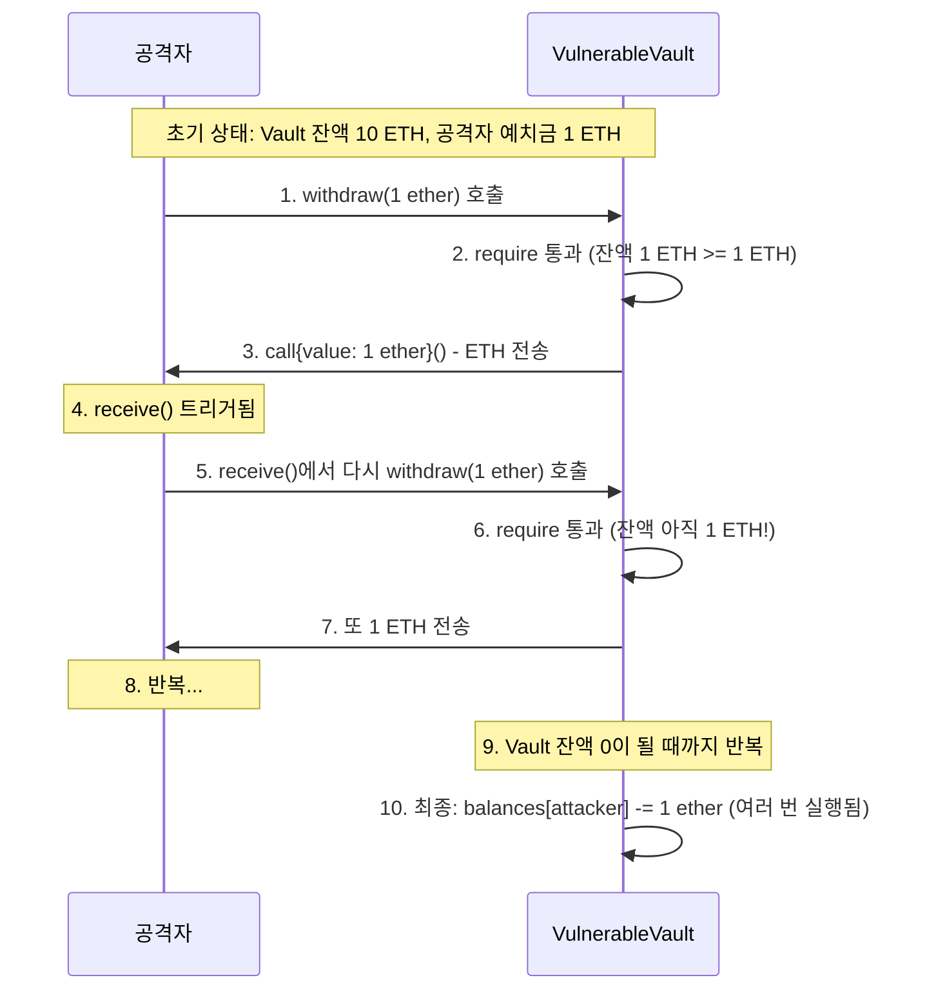

# Week 3 퀴즈: EVM/Security patterns

**제출 방법:**
1. 이 파일을 복사하여 `quiz-03-solution.md`로 저장
2. 각 문제에 답변 작성 (왜 그런지 설명 포함)
3. Pull Request 생성 (`quiz_submission` 템플릿 사용)

**평가 기준:**
- 정답 여부보다 **개념 이해도**를 중점 평가합니다
- 특히 **보안 취약점 식별과 방어 패턴**을 중점 평가합니다
- 코드 문제는 문법보다 보안 논리를 평가합니다

---

## 문제 1: [이론] EVM 개념 (객관식)

EVM(Ethereum Virtual Machine)이 "결정론적(deterministic)"으로 실행되어야 하는 이유는?

**보기:**
A) 모든 노드가 같은 CPU를 사용해야 하므로
B) 모든 노드가 같은 입력에 대해 같은 결과를 얻어야 합의가 가능하므로
C) 트랜잭션 처리 속도를 높이기 위해
D) 개발자가 코드를 디버깅하기 쉽게 하기 위해

**답변:**
<!--
정답과 함께, EVM에서 랜덤 함수나 외부 API 호출이 금지된 이유를 설명하세요.
-->
B
EVM에서 랜덤 함수나 외부 API 호출을 실행할 경우 랜덤 값이나 외부 상황 혹은 악의적인 공격자에 의해 노드별 결과값이 다르게 리턴될 수 있고, 이로 인해 어떤노드는 revert되며 어떤 노드는 상태가 바뀌는 비결정론적 동작을 야기할 수 있다. 이는 합의를 깨뜨리는 결과를 낳는다.

---

## 문제 2: [이론] Storage vs Memory (객관식)

다음 코드에서 `data` 변수의 저장 위치와 특성을 올바르게 설명한 것은?

```solidity
function process(uint[] memory data) public pure returns (uint) {
    uint sum = 0;
    for (uint i = 0; i < data.length; i++) {
        sum += data[i];
    }
    return sum;
}
```

**보기:**
A) Storage에 저장되며 함수 종료 후에도 유지된다
B) Memory에 저장되며 함수 종료 시 삭제된다
C) Stack에 저장되며 가장 비싼 저장 공간이다
D) Calldata에 저장되며 수정이 가능하다

**답변:**
<!--
정답과 함께, Storage/Memory/Stack의 비용 차이를 간단히 설명하세요.
힌트: 어떤 것이 가장 비싸고, 왜 비싼가요?
-->
B,명시적으로 memory키워드가 붙여져있기에 memory에 저장된다. memory에 저장되는 변수는 지역변수로 함수 종료시 소멸한다.
Storage에서의 비용이 가장 비싼데 그 이유는 이곳은 상태변수를 저장하는 공간이기 때문이다. 상태변수는 트랜잭션 종료 뒤에도 블록체인에 남아있으며 SSD에 쓰기 작업이 이루어지므로 비용이 제일 많이 요구되기에 가스비도 비싸다.

---

## 문제 3: [이론] Gas 비용 (객관식)

다음 중 Gas 비용이 가장 높은 연산은?

**보기:**
A) ADD (덧셈)
B) MUL (곱셈)
C) SLOAD (Storage 읽기)
D) SSTORE (Storage 쓰기)

**답변:**
<!--
정답과 함께, 왜 Storage 관련 연산이 비싼지 설명하세요.
힌트: Storage에 저장된 데이터는 어떤 특성이 있나요?
-->
D,Storage에 저장된 데이터는 컨트랙트가 존재하는 한 블록체인에 실제로 영속한다. 이는 전 세계의 수천 수만개의 풀 노드가 이 변수를 ssd에 실제로 저장하고 써야한다는 의미를 뜻하며 Storage상태가 합의에서 정의되는 상태에 영향을 끼치기 때문에 Storage가 같아야 합의가 가능하고, 이는 Storage가 커질수록 합의를 위한 노드 운영 비용이 올라가고 합의 속도가 느려짐을 뜻하기에 비용을 높게 책정하여 중앙화를 견제했다.

---

## 문제 4: [이론] CEI 패턴 (단답형)

**왜** CEI(Checks-Effects-Interactions) 패턴에서 Effects(상태 변경)가 Interactions(외부 호출)보다 먼저 와야 하나요?

재진입 공격 시나리오와 연결해서 구체적으로 설명하세요.

**답변:**
<!--
2-3 문장으로 설명하세요.
힌트:
- 외부 호출 시 상대방 컨트랙트의 코드가 실행됨
- 그 코드에서 다시 원래 함수를 호출하면?
- 상태가 변경되지 않은 상태라면 어떻게 될까요?
-->
외부 호출(예: call, transfer)을 하면 상대방 컨트랙트의 fallback/receive 함수가 실행될 수 있고, 악의적인 컨트랙트라면 그 안에서 원래 함수를 다시 호출할 수 있다.
이때 상태가 아직 변경되지 않았다면, 공격자는 잔액/허용량이 충분한 것으로 보이는 상태를 이용해 같은 돈을 여러 번 빼가는 재진입 공격을 성공시키는게 가능하다.
내부 상태를 안전하게 먼저 갱신(예: 잔액 차감, 플래그 설정) → 그 다음에야 외부 호출을 해야
재진입이 발생하더라도 이미 상태가 갱신되어 있어 공격이 실패한다.

---

## 문제 5: [이론] The DAO 사건 교훈 (단답형)

2016년 The DAO 해킹($60M 피해)에서 우리가 배워야 할 **가장 중요한 교훈**은 무엇인가요?

이 사건 이후 이더리움 생태계에 어떤 변화가 있었나요?

**답변:**
<!--
2-3 문장으로 설명하세요.
교훈:
- 기술적 교훈 (코드 작성 관점)
- 생태계 교훈 (이더리움 커뮤니티 관점)
-->
기술적 교훈으로는 "스마트 컨트랙트는 한 번 배포되면 수정 불가능하므로, 배포 전에 철저한 보안 감사를 하고 재진입같은 고전적 취약점을 반드시 제거해야 한다"는 것을 알려주었다.
이더리움 커뮤니티와 생태계에는 표준화된 보안 라이브러리가 대중화되었고, 대부분의 프로젝트가 배포 전 외부 보안감사가 필수가 되었다. "코드가 법이다"라는 불변성이 깨졌기에 우선순위를 사용자 자금보호과 네트워크 안정성으로 옮겨 실용적 관점을 가지게 되었다.

---

## 문제 6: [코드] 재진입 공격 식별 (취약점 찾기)

다음 코드에서 재진입 공격 취약점을 찾으세요:

```solidity
// BAD CODE - 취약점 찾기
contract VulnerableVault {
    mapping(address => uint256) public balances;

    function deposit() public payable {
        balances[msg.sender] += msg.value;
    }

    function withdraw(uint256 amount) public {
        require(balances[msg.sender] >= amount, "Insufficient balance");

        // ETH 전송
        (bool success, ) = msg.sender.call{value: amount}("");
        require(success, "Transfer failed");

        // 잔액 차감
        balances[msg.sender] -= amount;
    }
}
```

**1) 발견한 취약점:**
<!--
취약점 이름과 위치를 명시하세요.
힌트: withdraw 함수의 순서를 자세히 보세요.
-->
재진입 취약점을 withdraw 함수에서 찾았다

**2) 왜 이것이 문제인가:**
<!--
공격자가 어떻게 이 취약점을 악용할 수 있는지 단계별로 설명하세요.
-->
공격자가 Vault에 1 ETH를 deposit()으로 예치 → balances[attacker] = 1 ETH
=> 공격자가 withdraw(1 ETH) 호출
=> Vault는 require(balances >= 1 ETH) 통과
=> Vault가 msg.sender.call{value: 1 ETH}("") 실행 → 공격자 컨트랙트의 receive() 함수가 실행됨
=> receive() 안에서 다시 vault.withdraw(1 ETH)를 호출 (재진입)
=> Vault는 아직 잔액이 차감되지 않았기 때문에(balances[attacker] = 1 ETH 그대로)→ 다시 require 통과 → 또 1 ETH를 보내고 → 또 receive() 호출 → 무한 반복
=> Vault의 잔액이 0이 되거나 가스 한계에 도달할 때까지 ETH를 계속 빼감

**3) 올바른 수정 방법 (CEI 패턴):**
```solidity
// GOOD CODE - CEI 패턴으로 수정하세요
function withdraw(uint256 amount) public {
    // 여기에 안전한 코드를 작성하세요
    require(balances[msg.sender] >= amount, "Insufficient balance");
    balances[msg.sender] -= amount;
    (bool success, ) = msg.sender.call{value: amount}("");
    require(success, "Transfer failed");
    emit Withdrawn(msg.sender, amount);
}
```

---

## 문제 7: [코드] CEI 패턴 구현 (빈칸 채우기)

다음 코드의 빈칸을 채워 CEI 패턴을 완성하세요:

```solidity
function secureWithdraw(uint256 amount) public {
    // 1. Checks - 조건 확인
    require(______________________, "Insufficient balance");

    // 2. Effects - 상태 변경 (외부 호출 전에!)
    ______________________;

    // 3. Interactions - 외부 호출 (마지막에!)
    (bool success, ) = msg.sender.call{value: ______}("");
    require(success, "Transfer failed");
}
```

**답변:**
```solidity
// 빈칸을 채운 완성 코드를 작성하세요
function secureWithdraw(uint256 amount) public {
    // 1. Checks - 조건 확인
    require(balances[msg.sender] >= amount, "Insufficient balance");
    
    // 2. Effects - 상태 변경 (외부 호출 전에!)
    balances[msg.sender] -= amount;

    // 3. Interactions - 외부 호출 (마지막에!)
    (bool success, ) = msg.sender.call{value: amount}("");
    require(success, "Transfer failed");
}
```

**왜 이 순서가 중요한가요:**
<!--
CEI 순서가 재진입을 어떻게 방지하는지 설명하세요.
-->
Checks 단계에서 잔액을 확인한 후, Effects 단계에서 즉시 잔액을 차감한다 → 이제 balances[msg.sender]는 실제 출금하려는 금액만큼 줄어든 상태가 됨.
그 다음에야 외부 호출(call)을 수행.→ 만약 악성 컨트랙트가 receive()나 fallback()에서 다시 secureWithdraw()를 호출(재진입)하더라도,
이미 잔액이 차감되어 있기 때문에 두 번째 호출 시 require(balances[msg.sender] >= amount)가 실패한다.
결과적으로 재진입이 발생해도 추가 출금이 불가능해져서,
공격자는 한 번 출금한 금액만 받을 수 있고 Vault의 자금을 모두 탈취하는게 불가능해진다.

---

## 문제 8: [코드] tx.origin 취약점 (취약점 찾기)

다음 코드에서 보안 취약점을 찾으세요:

```solidity
// BAD CODE - 취약점 찾기
contract PhishingVulnerable {
    address public owner;

    constructor() {
        owner = msg.sender;
    }

    function transferOwnership(address newOwner) public {
        require(tx.origin == owner, "Not owner");
        owner = newOwner;
    }
}
```

**1) 발견한 취약점:**
<!--
tx.origin과 msg.sender의 차이와 관련된 문제입니다.
-->
tx.origin 인증 취약점을 찾을 수 있다.
msg.senders는 바로 직전 호출자를 의미해서 매 호출마다 바뀌므로 소유권 인증에 권장되지만 tx.origin은 트랜잭션을 최초로 보낸 EOA를 의미하며 트랜잭션 내내 동일하게 유지된다.

**2) 공격 시나리오:**
<!--
공격자가 어떻게 이 취약점을 악용할 수 있나요?
힌트: 공격자 컨트랙트를 통한 우회
-->
공격자가 악의적인 컨트랙트를 만들어놓고 피해자가 호출하도록 유도하면 msg.sender는 공격자이므로허가되지 않지만 tx.origin으로 검사시 공격자 컨트랙트를 거친후에도 tx.origin이 동일하기에 인증을 통과하게 된다. tx.origin은 트랜잭션의 시작점이 누구인지 알려줄 뿐, 누가 실제로 이 함수를 호출했는지를 보장하지 못하기 때문에 취약점인 것이다.

**3) 올바른 수정 방법:**
```solidity
// GOOD CODE - 수정된 코드를 작성하세요
function transferOwnership(address newOwner) public {
    require(msg.sender == owner, "Not owner");   // ← tx.origin 대신 msg.sender 사용
    owner = newOwner;
}
```

---

## 문제 9: [코드] ReentrancyGuard 적용 (빈칸 채우기)

다음 코드의 빈칸을 채워 ReentrancyGuard를 적용하세요:

```solidity
// TODO: OpenZeppelin import
______________________________________

// TODO: 상속 추가
contract SecureVault _________________ {
    mapping(address => uint256) public balances;

    function deposit() public payable {
        balances[msg.sender] += msg.value;
    }

    // TODO: modifier 추가
    function withdraw(uint256 amount) public _________________ {
        require(balances[msg.sender] >= amount, "Insufficient");
        balances[msg.sender] -= amount;
        (bool success, ) = msg.sender.call{value: amount}("");
        require(success, "Failed");
    }
}
```

**답변:**
```solidity
// 빈칸을 채운 완성 코드를 작성하세요
// OpenZeppelin import
import "@openzeppelin/contracts/security/ReentrancyGuard.sol";

// 상속 추가
contract SecureVault is ReentrancyGuard {
    mapping(address => uint256) public balances;

    function deposit() public payable {
        balances[msg.sender] += msg.value;
    }

    // modifier 추가
    function withdraw(uint256 amount) public nonReentrant {
        require(balances[msg.sender] >= amount, "Insufficient");
        balances[msg.sender] -= amount;
        (bool success, ) = msg.sender.call{value: amount}("");
        require(success, "Failed");
    }
}
```

**CEI 패턴 vs ReentrancyGuard - 언제 무엇을 사용하나요:**
<!--
두 방법의 장단점을 설명하세요.
-->
CEI 패턴은 개발자가 직접 순서를 조정해 재진입을 막기에 가스비가 적지만 개발자 실수에 취약하며 모든 함수에 수동적용해야한다.
ReentrancyGuard는 실수해도 문제없지만 가스비가 어느정도 추가된다.

---

## 문제 10: [다이어그램] 재진입 공격 흐름 해석 (다이어그램 분석)

다음 재진입 공격 시퀀스 다이어그램을 분석하세요:



**질문 1:** 6번에서 require 체크가 통과하는 이유는 무엇인가요?

**답변:**
<!--
상태 변경(balances 차감)이 언제 일어나는지 확인하세요.
-->
상태변경을 외부 함수 호출 이후에 진행하므로 외부 함수가 receive같은 방식으로 여러번 호출되는 경우 모두다 상태변경 이전이기 때문에 require를 만족하기 때문이다.

**질문 2:** CEI 패턴을 적용하면 6번에서 어떻게 되나요?

**답변:**
<!--
상태 변경 순서가 바뀌면 어떤 차이가 생기는지 설명하세요.
-->
공격자는 단 한 번만 출금할 수 있고, 더 이상 반복 출금이 불가능해진다. 외부함수 호출이전에 차감하므로 재진입시에는 require 만족이 안되기 때문이다.

**질문 3:** 공격자가 총 몇 ETH를 탈취할 수 있나요? (예치금 1 ETH, Vault 총 잔액 10 ETH 가정)

**답변:**
<!--
공격 시나리오를 수치로 분석해 보세요.
-->
10 ETH 전체를 탈취할 수 있다. balances 차감은 나중에 여러 번 실행되지만, 이미 ETH는 모두 보내진 후라 공격자는 1 ETH 예치로 10 ETH를 가져간다.

---

## 자기 평가

모든 문제를 풀었다면, 아래 체크리스트로 자기 평가를 해보세요:

- [x] EVM의 결정론적 실행 필요성을 이해했다
- [x] Storage/Memory/Stack의 차이와 비용을 알고 있다
- [x] 재진입 공격의 원리를 설명할 수 있다
- [x] CEI 패턴으로 재진입 공격을 방어할 수 있다
- [x] tx.origin vs msg.sender의 보안 차이를 알고 있다
- [x] ReentrancyGuard를 적용할 수 있다

---

## 참고 자료

- 이론: `eth-materials/week-03/theory/slides.md`
- 취약한 코드: `eth-homework/week-03/dev/src/Vault.sol`
- 안전한 코드: `eth-homework/week-03/dev/src/VaultSecure.sol`
- 테스트: `eth-homework/week-03/dev/test/Vault.t.sol`
- 용어: `eth-materials/resources/glossary.md`
