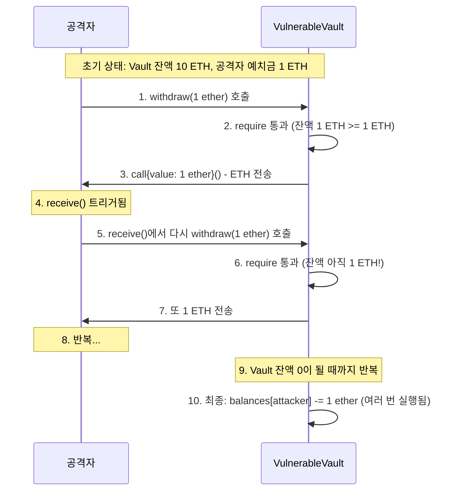

# Week 3 퀴즈: EVM/Security patterns

**제출 방법:**
1. 이 파일을 복사하여 `quiz-03-solution.md`로 저장
2. 각 문제에 답변 작성 (왜 그런지 설명 포함)
3. Pull Request 생성 (`quiz_submission` 템플릿 사용)

**평가 기준:**
- 정답 여부보다 **개념 이해도**를 중점 평가합니다
- 특히 **보안 취약점 식별과 방어 패턴**을 중점 평가합니다
- 코드 문제는 문법보다 보안 논리를 평가합니다

---

## 문제 1: [이론] EVM 개념 (객관식)

EVM(Ethereum Virtual Machine)이 "결정론적(deterministic)"으로 실행되어야 하는 이유는?

**보기:**
A) 모든 노드가 같은 CPU를 사용해야 하므로
B) 모든 노드가 같은 입력에 대해 같은 결과를 얻어야 합의가 가능하므로
C) 트랜잭션 처리 속도를 높이기 위해
D) 개발자가 코드를 디버깅하기 쉽게 하기 위해

**답변:**
<!--
정답과 함께, EVM에서 랜덤 함수나 외부 API 호출이 금지된 이유를 설명하세요.
--> B, 결정론적이지 않다면 합의는 불가능하고, 결국 여러 갈래로 fork되어 체인이 이어지지 않을 것이다.

랜덤함수-실행하는 노드의 환경이나 시점에 따라 다른 값을 반환하므로 합의가 깨짐
외부 api-컨트랙트가 외부 인터넷(Web2 서버 등)의 API를 직접 호출하면, 호출 시점의 서버 상태(응답 지연, 내용 변경, 접속 불가 등)에 따라 노드마다 다른 결과를 받게 되어 일관성이 무너짐. (외부 데이터가 필요할 때는 오라클(Oracle)이라는 합의된 방식을 통해서만 가져와야 함)


---

## 문제 2: [이론] Storage vs Memory (객관식)

다음 코드에서 `data` 변수의 저장 위치와 특성을 올바르게 설명한 것은?

```solidity
function process(uint[] memory data) public pure returns (uint) {
    uint sum = 0;
    for (uint i = 0; i < data.length; i++) {
        sum += data[i];
    }
    return sum;
}
```

**보기:**
A) Storage에 저장되며 함수 종료 후에도 유지된다
B) Memory에 저장되며 함수 종료 시 삭제된다
C) Stack에 저장되며 가장 비싼 저장 공간이다
D) Calldata에 저장되며 수정이 가능하다

**답변:**
<!--
정답과 함께, Storage/Memory/Stack의 비용 차이를 간단히 설명하세요.
힌트: 어떤 것이 가장 비싸고, 왜 비싼가요?
-->b, data는 메모리 키워드로 선언되었음. 함수 process 실행 동안에만 존재하다가 종료되면 지워진다.
스토리지- 비싸다. 모든 블록체인 노드에 기록되는 공간이고, 가스비도 비싸다
메모리- 함수 실행 동안에만 사용되는 공간(RAM). 함수가 종료되면 지워지므로 Storage보다 훨씬 저렴하다. 주로 배열, 문자열 같은 참조형 데이터를 함수 내에서 다룰 때 사용됨.
스택- 가장 빠르고 저렴. 크기가 제한적이고 uint, bool 같은 작은 지역 변수 저장하거나 연산 수행할때 사용.


---

## 문제 3: [이론] Gas 비용 (객관식)

다음 중 Gas 비용이 가장 높은 연산은?

**보기:**
A) ADD (덧셈)
B) MUL (곱셈)
C) SLOAD (Storage 읽기)
D) SSTORE (Storage 쓰기)

**답변:**
<!--
정답과 함께, 왜 Storage 관련 연산이 비싼지 설명하세요.
힌트: Storage에 저장된 데이터는 어떤 특성이 있나요?
-->d, 스토리지에 저장된 데이터는 블록체인의 모든 노드들에 기록되고 유지되어야하기 때문에 비용이 크다.
블록체인의 저장 공간은 매우 제한적이고 귀중한 자원이므로, 누군가 이 공간을 무분별하게 낭비하거나 악용(스팸 공격)하는 것을 막기 위해 스토리지 쓰기 연산에 가장 비싼 비용을 부과함.


---

## 문제 4: [이론] CEI 패턴 (단답형)

**왜** CEI(Checks-Effects-Interactions) 패턴에서 Effects(상태 변경)가 Interactions(외부 호출)보다 먼저 와야 하나요?

재진입 공격 시나리오와 연결해서 구체적으로 설명하세요.

**답변:**
<!--
2-3 문장으로 설명하세요.
힌트:
- 외부 호출 시 상대방 컨트랙트의 코드가 실행됨
- 그 코드에서 다시 원래 함수를 호출하면?
- 상태가 변경되지 않은 상태라면 어떻게 될까요?
--> 예를들어, a의 통장에 1만원이 있고, a는 이를 인출하려고 한다. 이때 인출을 먼저하고 a의 잔액을 0으로 깎으면, 인출(외부호출)-잔고변경(상태변경) 과정 중간에 다시 인출(외부호출)을 실행하면 무한정 돈을 인출할 수 있을 것이다. 이는 재진입 공격의 개념이다. 따라서 상태변경 이후에 외부호출을 해야한다.


---

## 문제 5: [이론] The DAO 사건 교훈 (단답형)

2016년 The DAO 해킹($60M 피해)에서 우리가 배워야 할 **가장 중요한 교훈**은 무엇인가요?

이 사건 이후 이더리움 생태계에 어떤 변화가 있었나요?

**답변:**
<!--
2-3 문장으로 설명하세요.
교훈:
- 기술적 교훈 (코드 작성 관점)
- 생태계 교훈 (이더리움 커뮤니티 관점)
-->기술적 측면에서는 스마트 컨트랙트 작성 시 재진입 공격의 위험성을 인지하고, 상태 변경을 먼저 하는 CEI 패턴의 중요성을 깨닫는 계기가 되었다. 생태계 측면에서는 해킹 피해를 롤백하기 위한 하드포크(Ethereum과 Ethereum Classic의 분리)를 겪으며, 코드가 법이라는 원칙과 커뮤니티의 합의 중 무엇이 우선시되어야 하는지에 대한 중요한 철학적 논쟁과 교훈을 남겼다.


---

## 문제 6: [코드] 재진입 공격 식별 (취약점 찾기)

다음 코드에서 재진입 공격 취약점을 찾으세요:

```solidity
// BAD CODE - 취약점 찾기
contract VulnerableVault {
    mapping(address => uint256) public balances;

    function deposit() public payable {
        balances[msg.sender] += msg.value;
    }

    function withdraw(uint256 amount) public {
        require(balances[msg.sender] >= amount, "Insufficient balance");

        // ETH 전송
        (bool success, ) = msg.sender.call{value: amount}("");
        require(success, "Transfer failed");

        // 잔액 차감
        balances[msg.sender] -= amount;
    }
}
```

**1) 발견한 취약점:**
<!--
취약점 이름과 위치를 명시하세요.
힌트: withdraw 함수의 순서를 자세히 보세요.
--> eth전송- 잔액 차감 순서가 바뀌어야한다. 재진입 공격이 가능하다.


**2) 왜 이것이 문제인가:**
<!--
공격자가 어떻게 이 취약점을 악용할 수 있는지 단계별로 설명하세요.
-->잔액이 차감되기 전에 eth전송 요청을 계속 실행시켜 계속 잔액을 빼갈 수 있다.


**3) 올바른 수정 방법 (CEI 패턴):**
```solidity
// GOOD CODE - CEI 패턴으로 수정하세요
function withdraw(uint256 amount) public {
    // 여기에 안전한 코드를 작성하세요
    require(balances[msg.sender] >= amount, "Insufficient balance");

        // 잔액 차감
        balances[msg.sender] -= amount;

        // ETH 전송
        (bool success, ) = msg.sender.call{value: amount}("");
        require(success, "Transfer failed");
}
```

---

## 문제 7: [코드] CEI 패턴 구현 (빈칸 채우기)

다음 코드의 빈칸을 채워 CEI 패턴을 완성하세요:

```solidity
function secureWithdraw(uint256 amount) public {
    // 1. Checks - 조건 확인
    require(balances[msg.sender] >= amount, "Insufficient balance");

    // 2. Effects - 상태 변경 (외부 호출 전에!)
    balances[msg.sender] -= amount;

    // 3. Interactions - 외부 호출 (마지막에!)
    (bool success, ) = msg.sender.call{value:amount}("");
    require(success, "Transfer failed");
}
```

**답변:**
```solidity
// 빈칸을 채운 완성 코드를 작성하세요
```

**왜 이 순서가 중요한가요:**
<!--
CEI 순서가 재진입을 어떻게 방지하는지 설명하세요.
-->잔액을 먼저 차감하고 다시 조건을 확인하므로 재진입을 시도해도 첫번째 조건에서 거부된다.


---

## 문제 8: [코드] tx.origin 취약점 (취약점 찾기)

다음 코드에서 보안 취약점을 찾으세요:

```solidity
// BAD CODE - 취약점 찾기
contract PhishingVulnerable {
    address public owner;

    constructor() {
        owner = msg.sender;
    }

    function transferOwnership(address newOwner) public {
        require(tx.origin == owner, "Not owner");
        owner = newOwner;
    }
}
```

**1) 발견한 취약점:**
<!--
tx.origin과 msg.sender의 차이와 관련된 문제입니다.
-->tx.origin == owner과정이 취약점이다. 이는 트랜잭션을 시작한 사람만 따져서 중간에 악의적인 컨트랙트가 끼워져있어도 실행되게 된다.


**2) 공격 시나리오:**
<!--
공격자가 어떻게 이 취약점을 악용할 수 있나요?
힌트: 공격자 컨트랙트를 통한 우회
-->공격자는 내부에 transferOwnership(공격자 주소)를 몰래 호출하는 악성 컨트랙트를 만듦.

공격자는 진짜 소유자(owner)를 속여서 이 악성 컨트랙트의 특정 함수(예: 무료 NFT 받기)를 직접 실행하도록 유도

소유자가 트랜잭션을 실행하면, 악성 컨트랙트가 취약한 컨트랙트를 호출. 이때 직접 호출한 msg.sender는 악성 컨트랙트지만, 트랜잭션을 맨 처음 발생시킨 tx.origin은 여전히 속은 소유자이므로 require 검증을 무사히 통과하여 소유권이 공격자에게 넘어가게 됨.


**3) 올바른 수정 방법:**
```solidity
// GOOD CODE - 수정된 코드를 작성하세요
contract PhishingVulnerable {
    address public owner;

    constructor() {
        owner = msg.sender;
    }

    function transferOwnership(address newOwner) public {
        require(msg.sender == owner, "Not owner");
        owner = newOwner;
    }
}
```

---

## 문제 9: [코드] ReentrancyGuard 적용 (빈칸 채우기)

다음 코드의 빈칸을 채워 ReentrancyGuard를 적용하세요:

```solidity
// TODO: OpenZeppelin import
______________________________________

// TODO: 상속 추가
contract SecureVault _________________ {
    mapping(address => uint256) public balances;

    function deposit() public payable {
        balances[msg.sender] += msg.value;
    }

    // TODO: modifier 추가
    function withdraw(uint256 amount) public _________________ {
        require(balances[msg.sender] >= amount, "Insufficient");
        balances[msg.sender] -= amount;
        (bool success, ) = msg.sender.call{value: amount}("");
        require(success, "Failed");
    }
}
```

**답변:**
```solidity
// 빈칸을 채운 완성 코드를 작성하세요
TODO: OpenZeppelin import
import "@openzeppelin/contracts/security/ReentrancyGuard.sol";

// TODO: 상속 추가
contract SecureVault is ReentrancyGuard {
    mapping(address => uint256) public balances;

    function deposit() public payable {
        balances[msg.sender] += msg.value;
    }

    // TODO: modifier 추가
    function withdraw(uint256 amount) public nonReentrant {
        require(balances[msg.sender] >= amount, "Insufficient");
        balances[msg.sender] -= amount;
        (bool success, ) = msg.sender.call{value: amount}("");
        require(success, "Failed");
    }
}
```

**CEI 패턴 vs ReentrancyGuard - 언제 무엇을 사용하나요:**
<!--
두 방법의 장단점을 설명하세요.
-->
-CEI 패턴 (기본 원칙)
장점: 변수의 순서만 바꾸는 논리적인 설계이므로, 추가적인 가스비용이 전혀 발생하지 않음. 
단점: 전적으로 개발자의 주의력에 의존하므로, 로직이 복잡해지거나 개발자가 실수로 순서를 어기면 바로 치명적인 해킹으로 이어짐.
-ReentrancyGuard (추가 안전장치)
장점: 코드에 nonReentrant라는 자물쇠만 달아주면 되므로 적용이 매우 쉽고, 개발자가 실수로 CEI 패턴을 어기더라도 시스템적으로 재진입을 완벽하게 막아줌. (특히 외부 호출이 여러 번 일어나는 복잡한 함수에서 유용.)
단점: 함수가 실행될 때마다 자물쇠 상태(상태 변수)를 잠그고 푸는 연산이 들어가기 때문에 추가적인 가스비가 꽤 소모됨.


---

## 문제 10: [다이어그램] 재진입 공격 흐름 해석 (다이어그램 분석)

다음 재진입 공격 시퀀스 다이어그램을 분석하세요:



**질문 1:** 6번에서 require 체크가 통과하는 이유는 무엇인가요?

**답변:**
<!--
상태 변경(balances 차감)이 언제 일어나는지 확인하세요.
--> 상태 변경이 10에서 일어나므로 잔액이 변하지 않았기 때문에 통과한다.


**질문 2:** CEI 패턴을 적용하면 6번에서 어떻게 되나요?

**답변:**
<!--
상태 변경 순서가 바뀌면 어떤 차이가 생기는지 설명하세요.
-->통과되지 못하고 멈춘다.


**질문 3:** 공격자가 총 몇 ETH를 탈취할 수 있나요? (예치금 1 ETH, Vault 총 잔액 10 ETH 가정)

**답변:**
<!--
공격 시나리오를 수치로 분석해 보세요.
-->10번, 금고(Vault) 전체에 10 ETH가 있으므로, 가스가 허용하는 한 금고의 잔고가 0이 될 때까지 계속 재진입하여 자신의 예치금 1 ETH를 포함한 금고 안의 모든 돈을 탈취한다.


---

## 자기 평가

모든 문제를 풀었다면, 아래 체크리스트로 자기 평가를 해보세요:

- [o] EVM의 결정론적 실행 필요성을 이해했다
- [o] Storage/Memory/Stack의 차이와 비용을 알고 있다
- [o] 재진입 공격의 원리를 설명할 수 있다
- [o] CEI 패턴으로 재진입 공격을 방어할 수 있다
- [o] tx.origin vs msg.sender의 보안 차이를 알고 있다
- [o] ReentrancyGuard를 적용할 수 있다

---

## 참고 자료

- 이론: `eth-materials/week-03/theory/slides.md`
- 취약한 코드: `eth-homework/week-03/dev/src/Vault.sol`
- 안전한 코드: `eth-homework/week-03/dev/src/VaultSecure.sol`
- 테스트: `eth-homework/week-03/dev/test/Vault.t.sol`
- 용어: `eth-materials/resources/glossary.md`
