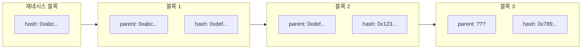
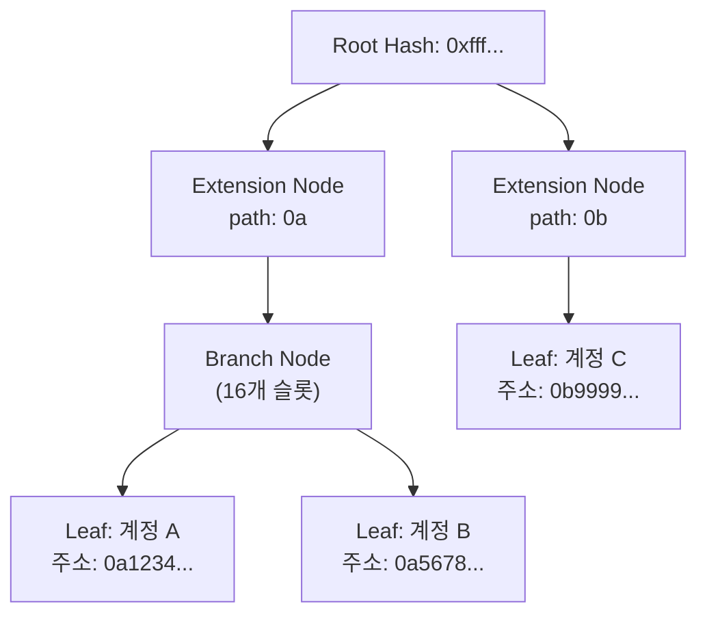

# Week 4 Quiz: Network/Block + wagmi

> **제출 방법:** 이 파일을 복사하여 답변을 작성한 후, PR로 제출하세요.
> **평가 기준:** 개념 이해도 중심 - 문법 오류보다 논리적 설명을 중시합니다.

---

## 문제 1: 블록 헤더 필드 (객관식)

다음 상황을 고려하세요:

```
블록 100의 해시: 0xabc123...
블록 101의 해시: 0xdef456...
```

블록 101의 `parentHash` 필드에는 어떤 값이 저장되어 있나요? 그리고 **왜** 이런 방식으로 연결하나요?

**보기:**
A) 0xdef456... - 자기 자신의 해시를 저장하여 무결성을 보장한다
B) 0xabc123... - 이전 블록의 해시를 저장하여 체인 연결과 불변성을 보장한다
C) 블록 번호 100 - 숫자로 순서를 추적한다
D) 빈 값 - 헤더에는 해시가 저장되지 않는다

**답변:**
<!--
정답 알파벳과 왜 이 답을 선택했는지 설명하세요.
다른 보기가 왜 틀린지도 간략히 설명해 주세요.
-->


---

## 문제 2: MPT 목적 (객관식)

이더리움에서 Merkle Patricia Trie(MPT)를 사용하는 **가장 중요한 이유**는 무엇인가요?

**보기:**
A) 데이터를 암호화하여 외부에서 읽을 수 없게 한다
B) 트랜잭션 처리 속도를 10배 이상 높인다
C) 전체 데이터 없이도 특정 데이터의 존재와 정확성을 효율적으로 증명한다
D) 블록 크기를 줄여서 저장 공간을 절약한다

**답변:**
<!--
정답 알파벳과 왜 이 기능이 중요한지 설명하세요.
Light Node와 연결지어 설명하면 더 좋습니다.
-->


---

## 문제 3: 체인 연결과 보안 (객관식)

공격자가 블록 50의 트랜잭션을 수정하려고 합니다. 현재 체인의 최신 블록은 100입니다. 이 공격이 **왜** 어려운가요?

**보기:**
A) 블록 50은 너무 오래되어서 시스템에서 접근할 수 없다
B) 블록 50을 수정하면 해시가 바뀌고, 블록 51부터 100까지 모든 블록의 parentHash가 불일치하게 된다
C) 블록 50은 이미 암호화되어 있어서 복호화 키가 필요하다
D) 네트워크 관리자만 과거 블록을 수정할 수 있다

**답변:**
<!--
정답 알파벳과 블록체인의 불변성이 어떻게 작동하는지 설명하세요.
-->


---

## 문제 4: MPT 진화 과정 (단답형)

MPT(Merkle Patricia Trie)는 세 가지 자료구조의 장점을 결합한 것입니다:
1. **Trie** -> 2. **Patricia Trie** -> 3. **Merkle Patricia Trie**

**왜** 각 단계의 발전이 필요했나요? 각 단계가 해결하는 문제를 간단히 설명하세요.

**답변:**
<!--
1. Trie가 해결하는 문제:

2. Patricia Trie가 해결하는 문제 (Trie의 한계):

3. Merkle Patricia Trie가 해결하는 문제 (Patricia Trie의 한계):

-->


---

## 문제 5: Eclipse Attack 방어 (단답형)

Eclipse Attack은 공격자가 피해자 노드의 **모든 피어 연결**을 자신이 통제하는 노드로 바꾸는 공격입니다.

1) 이 공격이 성공하면 피해자에게 **어떤 피해**가 발생할 수 있나요?
2) 개인 노드 운영자가 이 공격을 **방어**하기 위해 할 수 있는 행동은 무엇인가요?

**답변:**
<!--
1) 가능한 피해 (2가지 이상):


2) 방어 방법 (2가지 이상):

-->


---

## 문제 6: 노드 종류 선택 (단답형)

친구가 이더리움 개발을 시작하려고 합니다. 다음 세 가지 상황에서 각각 어떤 노드 타입(Full, Light, Archive)을 추천하시겠습니까? **왜** 그 노드를 추천하는지도 설명하세요.

1) 모바일 지갑 앱 개발
2) 블록체인 데이터 분석 서비스 개발
3) 일반적인 dApp 백엔드 개발

**답변:**
<!--
1) 모바일 지갑 앱:
   추천 노드:
   이유:

2) 블록체인 데이터 분석:
   추천 노드:
   이유:

3) dApp 백엔드:
   추천 노드:
   이유:
-->


---

## 문제 7: useAccount Hook (빈칸 채우기)

다음 코드의 빈칸을 채워서 지갑 연결 상태를 표시하는 컴포넌트를 완성하세요:

```typescript
import { _________________ } from 'wagmi';

function WalletStatus() {
  // TODO: useAccount hook에서 필요한 값들을 가져오세요
  const { _________________, _________________ } = useAccount();

  if (!isConnected) {
    return <div>지갑이 연결되지 않았습니다</div>;
  }

  return (
    <div>
      <p>연결된 주소: {address}</p>
    </div>
  );
}
```

**답변:**
```typescript
// 완성된 코드를 여기에 작성하세요

```

**왜 이렇게 작성했나요:**
<!--
useAccount hook이 제공하는 값들과 각각의 역할을 설명하세요.
-->


---

## 문제 8: useReadContract Hook (빈칸 채우기)

다음 코드의 빈칸을 채워서 컨트랙트의 `getCount` 함수 결과를 화면에 표시하세요:

```typescript
import { useReadContract } from 'wagmi';

const counterABI = [
  {
    name: 'getCount',
    type: 'function',
    stateMutability: 'view',
    inputs: [],
    outputs: [{ name: 'count', type: 'uint256' }],
  },
] as const;

function CountDisplay() {
  const { data, isLoading, error } = useReadContract({
    // TODO: 필요한 설정을 채우세요
    address: '0x1234...5678',
    _________________,
    _________________,
  });

  if (isLoading) return <div>로딩 중...</div>;
  if (error) return <div>에러 발생</div>;

  return <div>현재 카운트: {_________________}</div>;
}
```

**답변:**
```typescript
// 완성된 코드를 여기에 작성하세요

```

**왜 이렇게 작성했나요:**
<!--
useReadContract의 필수 설정 항목과 data를 화면에 표시할 때 주의할 점을 설명하세요.
-->


---

## 문제 9: useWriteContract 버그 (취약점 찾기)

다음 코드에서 **문제점**을 찾고 수정하세요:

```typescript
// BAD CODE - 문제점 찾기
import { useWriteContract } from 'wagmi';

function IncrementButton() {
  const { writeContract, isPending } = useWriteContract();

  const handleClick = () => {
    // 문제가 있는 코드
    writeContract({
      address: '0x1234...5678',
      functionName: 'increment',
      // abi가 없음!
    });
  };

  return (
    <button onClick={handleClick} disabled={isPending}>
      증가하기
    </button>
  );
}
```

**1) 발견한 문제점:**
<!--
무엇이 빠졌거나 잘못되었는지 설명하세요.
-->


**2) 왜 이것이 문제인가:**
<!--
이 문제가 어떤 오류나 동작 이상을 일으키는지 설명하세요.
-->


**3) 올바른 수정 방법:**
```typescript
// GOOD CODE - 수정된 버전을 작성하세요

```

---

## 문제 10: 블록 연결 구조 (다이어그램 해석)

다음 다이어그램은 블록체인의 연결 구조를 보여줍니다:



**질문:**

1) 블록 3의 `parent: ???` 에 들어갈 값은 무엇인가요?


2) 만약 블록 1의 내용이 수정되면, 블록 2와 블록 3에 **어떤 영향**이 있나요? 왜 그런가요?


3) 제네시스 블록(블록 0)의 parentHash는 어떤 특별한 값을 가지나요? 왜 그런가요?


---

## 문제 11: MPT 트리 구조 (다이어그램 해석)

다음 다이어그램은 MPT의 노드 구조를 보여줍니다:



**질문:**

1) 계정 A와 계정 B가 같은 Branch Node 아래에 있는 이유는 무엇인가요? (주소 패턴을 힌트로 사용하세요)


2) Extension Node가 하는 역할은 무엇인가요? 없다면 어떤 문제가 생기나요?


3) Root Hash만 알면 어떻게 특정 계정의 데이터 존재를 **증명**할 수 있나요? (Light Client 관점에서)


---

## 제출 전 체크리스트

- [ ] 모든 문제에 답변을 작성했는가?
- [ ] 객관식 문제: 정답 선택 **이유**를 설명했는가?
- [ ] 단답형 문제: 2-3문장 이상으로 충분히 설명했는가?
- [ ] 코드 문제: 완성된 코드와 **왜 그렇게 작성했는지** 설명했는가?
- [ ] 다이어그램 문제: 각 질문에 논리적으로 답변했는가?
