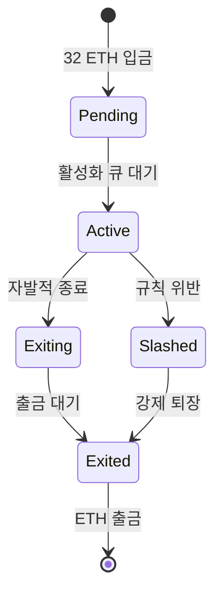
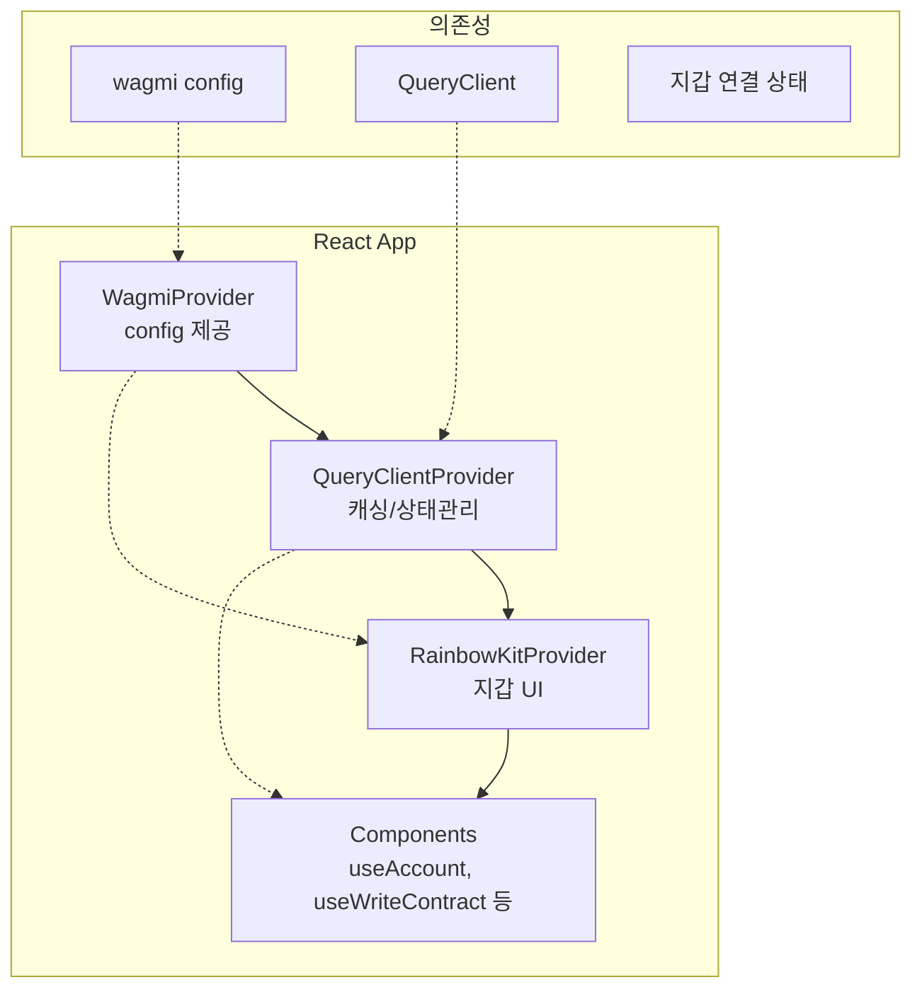

# Week 5 Quiz: PoS/Consensus + RainbowKit

> **제출 방법:** 이 파일을 복사하여 답변을 작성한 후, PR로 제출하세요.
> **평가 기준:** 개념 이해도 중심 - 문법 오류보다 논리적 설명을 중시합니다.

---

## 문제 1: PoS 개념 (객관식)

이더리움이 PoW(작업 증명)에서 PoS(지분 증명)로 전환한 **가장 주요한 이유**는 무엇인가요?

**보기:**
A) 트랜잭션 처리 속도를 10배 이상 높이기 위해
B) 에너지 소비를 99.95% 이상 줄이고 환경 친화적으로 만들기 위해
C) 블록 크기를 늘려서 더 많은 데이터를 저장하기 위해
D) 채굴 장비 없이도 누구나 블록을 생성할 수 있게 하기 위해

**답변:**
<!--
정답 알파벳과 왜 이 답을 선택했는지 설명하세요.
PoW의 문제점과 PoS의 해결책을 연결지어 설명하면 더 좋습니다.
-->


---

## 문제 2: 검증자 역할 (객관식)

이더리움 PoS에서 검증자(Validator)가 수행하는 **두 가지 주요 역할**은 무엇인가요?

**보기:**
A) 블록 채굴(Mining)과 가스 가격 결정
B) 블록 제안(Proposing)과 블록 증명(Attesting)
C) 트랜잭션 전송과 수수료 수집
D) 스마트 컨트랙트 배포와 실행

**답변:**
<!--
정답 알파벳과 각 역할이 무엇을 의미하는지 설명하세요.
-->


---

## 문제 3: 왜 PoW에서 PoS로? (단답형)

PoW(작업 증명)와 PoS(지분 증명)의 **핵심 차이점**은 무엇인가요?
"자격 증명 방식"과 "보안 보장 방식" 두 관점에서 각각 비교하세요.

**답변:**
<!--
자격 증명 방식:
- PoW:
- PoS:

보안 보장 방식:
- PoW:
- PoS:
-->


---

## 문제 4: 슬래싱의 목적 (단답형)

슬래싱(Slashing)은 검증자의 스테이킹된 ETH를 **강제로 소각**하는 패널티입니다.

1) 슬래싱이 발동되는 **두 가지 조건**은 무엇인가요?
2) **왜** 이런 처벌이 필요한가요? 없다면 어떤 문제가 생길 수 있나요?

**답변:**
<!--
1) 슬래싱 조건 (2가지):
   -
   -

2) 슬래싱이 필요한 이유:

-->


---

## 문제 5: 체인 선택 규칙 (단답형)

여러 유효한 블록이 동시에 제안되면 **포크(Fork)**가 발생합니다.
이더리움의 LMD-GHOST(Latest Message Driven GHOST) 규칙은 어떻게 "정규 체인"을 선택하나요?

1) LMD-GHOST의 기본 원리는 무엇인가요?
2) **왜** "가장 최근 메시지"를 사용하나요? (오래된 메시지를 사용하면 어떤 문제가?)

**답변:**
<!--
1) LMD-GHOST 원리:


2) 최근 메시지 사용 이유:

-->


---

## 문제 6: RainbowKit Provider 계층 (빈칸 채우기)

다음 코드의 빈칸을 채워서 RainbowKit을 올바르게 설정하세요.
**Provider 순서가 중요합니다!**

```typescript
'use client';

// TODO: 필요한 스타일 import
_________________________________________

import { RainbowKitProvider } from '@rainbow-me/rainbowkit';
import { WagmiProvider } from 'wagmi';
import { QueryClientProvider, QueryClient } from '@tanstack/react-query';
import { config } from '@/config/wagmi';

const queryClient = new QueryClient();

export default function RootLayout({ children }) {
  return (
    <html lang="ko">
      <body>
        {/* TODO: Provider를 올바른 순서로 중첩하세요 */}
        <_________________ config={config}>
          <_________________ client={queryClient}>
            <_________________>
              {children}
            </_________________>
          </_________________>
        </_________________>
      </body>
    </html>
  );
}
```

**답변:**
```typescript
// 완성된 코드를 여기에 작성하세요

```

**왜 이 순서인가요:**
<!--
Provider 순서가 왜 중요한지 설명하세요.
순서가 잘못되면 어떤 오류가 발생하나요?
-->


---

## 문제 7: Provider 순서 버그 (취약점 찾기)

다음 코드에서 **문제점**을 찾고 수정하세요:

```typescript
// BAD CODE - 문제점 찾기
'use client';

import '@rainbow-me/rainbowkit/styles.css';
import { RainbowKitProvider } from '@rainbow-me/rainbowkit';
import { WagmiProvider } from 'wagmi';
import { QueryClientProvider, QueryClient } from '@tanstack/react-query';
import { config } from '@/config/wagmi';

const queryClient = new QueryClient();

export default function Providers({ children }) {
  return (
    // 문제가 있는 Provider 순서!
    <QueryClientProvider client={queryClient}>
      <RainbowKitProvider>
        <WagmiProvider config={config}>
          {children}
        </WagmiProvider>
      </RainbowKitProvider>
    </QueryClientProvider>
  );
}
```

**1) 발견한 문제점:**
<!--
무엇이 잘못되었는지 설명하세요.
-->


**2) 왜 이것이 문제인가:**
<!--
이 순서로 인해 어떤 오류가 발생하는지 설명하세요.
-->


**3) 올바른 수정 방법:**
```typescript
// GOOD CODE - 수정된 버전을 작성하세요

```

---

## 문제 8: 트랜잭션 상태 처리 (빈칸 채우기)

다음 코드의 빈칸을 채워서 트랜잭션 전송 후 **확인 상태를 추적**하세요:

```typescript
'use client';

import { useWriteContract, _________________ } from 'wagmi';

const abi = [
  {
    name: 'increment',
    type: 'function',
    stateMutability: 'nonpayable',
    inputs: [],
    outputs: [],
  },
] as const;

function IncrementButton() {
  const { writeContract, data: hash, isPending } = useWriteContract();

  // TODO: 트랜잭션 확인 상태를 추적하는 hook
  const { isLoading: isConfirming, isSuccess } = _________________({
    _________________,
  });

  return (
    <div>
      <button
        onClick={() =>
          writeContract({
            address: '0x1234...5678',
            abi,
            functionName: 'increment',
          })
        }
        disabled={isPending || isConfirming}
      >
        {isPending ? '서명 대기 중...' : isConfirming ? '확인 중...' : '증가'}
      </button>

      {isSuccess && <p>트랜잭션 성공!</p>}
    </div>
  );
}
```

**답변:**
```typescript
// 완성된 코드를 여기에 작성하세요

```

**트랜잭션 상태 흐름을 설명하세요:**
<!--
1) isPending 상태:
2) isConfirming 상태:
3) isSuccess 상태:
-->


---

## 문제 9: 검증자 생애주기 (다이어그램 해석)

다음 다이어그램은 이더리움 검증자의 생애주기를 보여줍니다:



**질문:**

1) **Active** 상태에서 검증자가 수행하는 주요 활동은 무엇인가요?


2) Active에서 **Slashed**로 전이되는 조건은 무엇인가요? 이 경우 검증자에게 어떤 일이 발생하나요?


3) 검증자가 자발적으로 종료(**Exiting**)하려면 왜 바로 ETH를 출금할 수 없고 대기 기간이 필요한가요?


---

## 문제 10: Provider 계층 구조 (다이어그램 해석)

다음 다이어그램은 RainbowKit/wagmi 앱의 Provider 구조를 보여줍니다:



**질문:**

1) **WagmiProvider**가 가장 바깥에 있어야 하는 이유는 무엇인가요?


2) **QueryClientProvider**의 역할은 무엇인가요? 없다면 어떤 문제가 발생하나요?


3) 아래 코드에서 `useAccount()` hook이 **"Cannot find WagmiContext"** 오류를 발생시키는 이유는 무엇인가요?

```typescript
// 오류 발생 코드
<QueryClientProvider>
  <RainbowKitProvider>
    <WagmiProvider>  {/* WagmiProvider가 안쪽에 있음 */}
      <MyComponent />  {/* useAccount() 호출 */}
    </WagmiProvider>
  </RainbowKitProvider>
</QueryClientProvider>
```


---

## 제출 전 체크리스트

- [ ] 모든 문제에 답변을 작성했는가?
- [ ] 객관식 문제: 정답 선택 **이유**를 설명했는가?
- [ ] 단답형 문제: 2-3문장 이상으로 충분히 설명했는가?
- [ ] 코드 문제: 완성된 코드와 **왜 그렇게 작성했는지** 설명했는가?
- [ ] 다이어그램 문제: 각 질문에 논리적으로 답변했는가?
