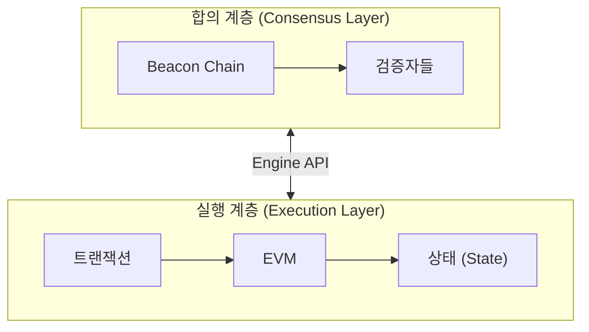
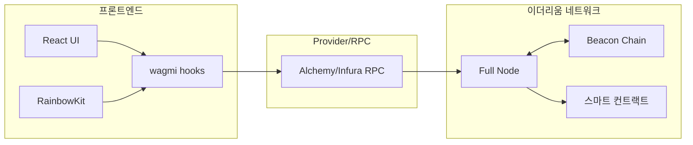

# Week 6 Quiz: Beacon Chain/Finality + Final Project Integration

> **제출 방법:** 이 파일을 복사하여 답변을 작성한 후, PR로 제출하세요.
> **평가 기준:** 개념 이해도 중심 - 6주간 배운 내용을 **통합**하여 설명하세요.

---

## 문제 1: Beacon Chain 역할 (객관식)

Beacon Chain의 **주요 역할**은 무엇인가요?

**보기:**
A) 스마트 컨트랙트를 실행하고 상태를 관리한다
B) 검증자를 관리하고 합의를 조정하며 블록 최종성을 결정한다
C) 트랜잭션 수수료를 계산하고 분배한다
D) 사용자의 지갑을 생성하고 개인키를 관리한다

**답변:**
<!--
정답 알파벳과 Beacon Chain이 "합의 계층(Consensus Layer)"으로서 하는 역할을 설명하세요.
실행 계층(Execution Layer)과의 차이도 언급하면 더 좋습니다.
-->


---

## 문제 2: Finality 개념 (객관식)

이더리움에서 **Finality(최종성)**가 달성되면 어떤 상태인가요?

**보기:**
A) 트랜잭션이 mempool에 들어간 상태
B) 블록이 체인에 추가되었지만 아직 재조직(reorg)될 수 있는 상태
C) 전체 검증자의 1/3 이상이 슬래싱되지 않는 한 절대 변경되지 않는 상태
D) 24시간이 지나서 트랜잭션이 만료된 상태

**답변:**
<!--
정답 알파벳과 왜 "1/3 이상 슬래싱"이 조건인지 설명하세요.
Finality가 왜 중요한지도 언급하세요.
-->


---

## 문제 3: 왜 Finality가 중요한가 (단답형)

거래소나 dApp 개발자에게 **Finality**가 왜 중요한가요?
다음 시나리오를 예로 들어 설명하세요:

> 사용자가 거래소에 100 ETH를 입금하고, 거래소가 확인 후 내부 잔액에 반영했습니다.
> 그런데 나중에 블록 재조직(reorg)이 발생하여 입금 트랜잭션이 사라졌습니다.

**답변:**
<!--
1) 위 시나리오에서 거래소에 어떤 문제가 발생하나요?

2) Finality가 있으면 이 문제가 어떻게 해결되나요?

3) 이더리움에서 Finality까지 얼마나 기다려야 하나요?
-->


---

## 문제 4: 포크 선택 규칙 (단답형)

이더리움은 **Casper FFG**와 **LMD-GHOST** 두 가지 메커니즘을 결합합니다.
각각의 역할은 무엇이며, **왜** 둘 다 필요한가요?

**답변:**
<!--
1) Casper FFG의 역할:

2) LMD-GHOST의 역할:

3) 왜 둘 다 필요한가 (한쪽만 있으면 어떤 문제?):
-->


---

## 문제 5: dApp 아키텍처 설계 (코드/아키텍처 문제)

당신은 "간단한 투표 dApp"을 만들려고 합니다.
다음 요구사항을 읽고 **컴포넌트 구조**와 **사용할 hook**들을 설계하세요.

**요구사항:**
- 사용자가 지갑을 연결할 수 있다
- 현재 투표 현황(찬성/반대 수)을 조회할 수 있다
- 사용자가 찬성 또는 반대 투표를 할 수 있다
- 투표 후 결과가 화면에 즉시 반영된다

**답변:**

```
1) 컴포넌트 구조 (어떤 컴포넌트가 필요한가):


2) 각 컴포넌트에서 사용할 wagmi/RainbowKit hook:
   - 지갑 연결:
   - 투표 현황 조회:
   - 투표 실행:
   - 트랜잭션 확인:


3) Provider 계층 구조:

```

**왜 이렇게 설계했나요:**
<!--
각 hook의 선택 이유와 데이터 흐름을 설명하세요.
-->


---

## 문제 6: 컨트랙트-프론트엔드 연동 (빈칸 채우기)

다음 코드의 빈칸을 채워서 투표 컨트랙트와 프론트엔드를 연동하세요:

**Solidity 컨트랙트:**
```solidity
contract Voting {
    uint256 public yesVotes;
    uint256 public noVotes;

    function voteYes() external {
        yesVotes += 1;
    }

    function voteNo() external {
        noVotes += 1;
    }
}
```

**React 컴포넌트:**
```typescript
import { useReadContract, useWriteContract, _________________ } from 'wagmi';

const votingABI = [
  { name: 'yesVotes', type: 'function', stateMutability: 'view', inputs: [], outputs: [{ type: 'uint256' }] },
  { name: 'noVotes', type: 'function', stateMutability: 'view', inputs: [], outputs: [{ type: 'uint256' }] },
  { name: 'voteYes', type: 'function', stateMutability: 'nonpayable', inputs: [], outputs: [] },
  { name: 'voteNo', type: 'function', stateMutability: 'nonpayable', inputs: [], outputs: [] },
] as const;

function VotingApp() {
  // 찬성 투표 수 조회
  const { data: yesCount, refetch: refetchYes } = useReadContract({
    address: '0x1234...5678',
    abi: votingABI,
    functionName: '_________________',
  });

  // 반대 투표 수 조회
  const { data: noCount, refetch: refetchNo } = useReadContract({
    address: '0x1234...5678',
    abi: votingABI,
    functionName: '_________________',
  });

  // 투표 실행
  const { writeContract, data: hash, isPending } = useWriteContract();

  // 트랜잭션 확인 대기
  const { isLoading: isConfirming, isSuccess } = _________________({
    hash,
  });

  // 트랜잭션 성공 시 데이터 새로고침
  // TODO: isSuccess가 true가 되면 refetch를 호출해야 함

  const handleVoteYes = () => {
    writeContract({
      address: '0x1234...5678',
      abi: votingABI,
      functionName: '_________________',
    });
  };

  return (
    <div>
      <h2>현재 투표 현황</h2>
      <p>찬성: {_________________}</p>
      <p>반대: {noCount?.toString()}</p>

      <button onClick={handleVoteYes} disabled={isPending || isConfirming}>
        {isPending ? '서명 중...' : isConfirming ? '확인 중...' : '찬성 투표'}
      </button>

      {isSuccess && <p>투표 완료!</p>}
    </div>
  );
}
```

**답변:**
```typescript
// 완성된 코드를 여기에 작성하세요

```

**데이터 흐름을 설명하세요:**
<!--
1) 사용자가 "찬성 투표" 버튼 클릭 -> ... -> 화면 업데이트까지의 과정을 설명하세요.
-->


---

## 문제 7: 트랜잭션 흐름 디버깅 (취약점 찾기)

다음 코드에서 **문제점**을 찾고 수정하세요. 사용자가 투표를 해도 화면이 업데이트되지 않습니다.

```typescript
// BAD CODE - 왜 화면이 업데이트되지 않나요?
function BrokenVoting() {
  const { data: voteCount } = useReadContract({
    address: '0x...',
    abi: votingABI,
    functionName: 'yesVotes',
  });

  const { writeContract, data: hash } = useWriteContract();

  const { isSuccess } = useWaitForTransactionReceipt({ hash });

  const handleVote = () => {
    writeContract({
      address: '0x...',
      abi: votingABI,
      functionName: 'voteYes',
    });
  };

  // isSuccess가 true가 되어도 voteCount가 업데이트되지 않음!

  return (
    <div>
      <p>찬성: {voteCount?.toString()}</p>
      <button onClick={handleVote}>투표</button>
      {isSuccess && <p>투표 완료!</p>}
    </div>
  );
}
```

**1) 발견한 문제점:**
<!--
왜 화면이 업데이트되지 않는지 설명하세요.
-->


**2) 올바른 수정 방법:**
```typescript
// GOOD CODE - 수정된 버전을 작성하세요

```

**3) refetch가 필요한 이유:**
<!--
블록체인 데이터와 React 상태의 관계를 설명하세요.
-->


---

## 문제 8: Beacon Chain 구조 (다이어그램 해석)

다음 다이어그램은 이더리움의 두 계층 구조를 보여줍니다:



**질문:**

1) **합의 계층(CL)**과 **실행 계층(EL)**의 역할 차이는 무엇인가요?


2) **Engine API**를 통해 두 계층이 주고받는 정보는 무엇인가요?


3) 사용자가 트랜잭션을 전송하면 CL과 EL에서 각각 어떤 일이 일어나나요?


---

## 문제 9: Slot/Epoch 관계 (다이어그램 해석)

다음 다이어그램은 Slot과 Epoch의 관계를 보여줍니다:

```mermaid
gantt
    title Epoch 구조 (6.4분)
    dateFormat X
    axisFormat %s

    section Epoch N
    Slot 0     :a1, 0, 12
    Slot 1     :a2, 12, 24
    Slot 2     :a3, 24, 36
    ...        :a4, 36, 372
    Slot 31    :a5, 372, 384

    section Checkpoint
    Epoch N 끝 :milestone, 384, 0
```



**질문:**

1) 1 Slot은 몇 초이고, 1 Epoch은 몇 개의 Slot으로 구성되나요?


2) **Checkpoint**는 언제 발생하며 어떤 역할을 하나요?


3) **Finality**가 달성되려면 몇 Epoch이 필요하고, 시간으로는 약 몇 분인가요?


---

## 문제 10: dApp 전체 아키텍처 (다이어그램 해석)

다음 다이어그램은 dApp의 전체 아키텍처를 보여줍니다:



**질문:**

1) 사용자가 **"투표하기" 버튼**을 클릭하면, UI에서 스마트 컨트랙트까지 데이터가 어떤 경로로 전달되나요?


2) **RPC Provider**(Alchemy/Infura)의 역할은 무엇인가요? 없다면 어떤 문제가 생기나요?


3) 6주간 배운 내용을 종합하여, 트랜잭션이 **전송 -> 실행 -> 블록 포함 -> Finality**까지 거치는 전체 흐름을 설명하세요.


---

## 제출 전 체크리스트

- [ ] 모든 문제에 답변을 작성했는가?
- [ ] 객관식 문제: 정답 선택 **이유**를 설명했는가?
- [ ] 단답형 문제: 2-3문장 이상으로 충분히 설명했는가?
- [ ] 코드 문제: 완성된 코드와 **왜 그렇게 작성했는지** 설명했는가?
- [ ] 다이어그램 문제: 6주간 배운 내용을 **연결**지어 설명했는가?

---

## 6주 과정 축하합니다!

이 퀴즈를 완료하면 6주 이더리움 온보딩 이론 과정이 마무리됩니다.

**배운 것들:**
- Week 1: State, Account, EOA vs CA
- Week 2: Transaction, Signature, Security (Private Key)
- Week 3: EVM, Gas, Security (Reentrancy, CEI)
- Week 4: Block, Network, MPT, Security (Eclipse, 51%)
- Week 5: PoS, Validator, Consensus, RainbowKit
- Week 6: Beacon Chain, Finality, Full-stack Integration

**다음 단계:** 나만의 dApp 프로젝트를 시작하세요!
